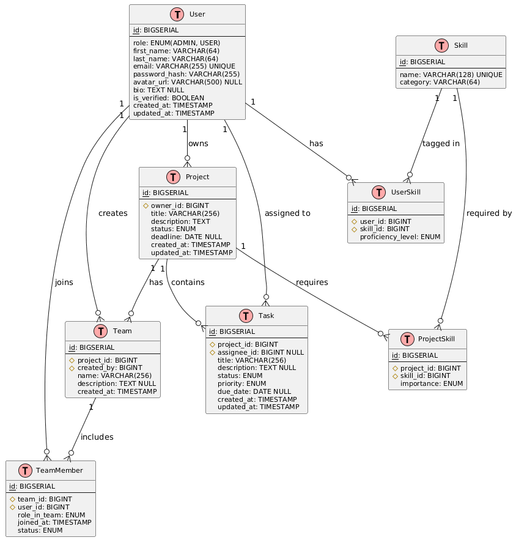
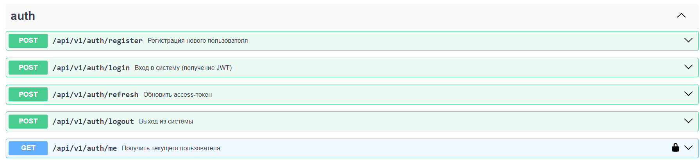
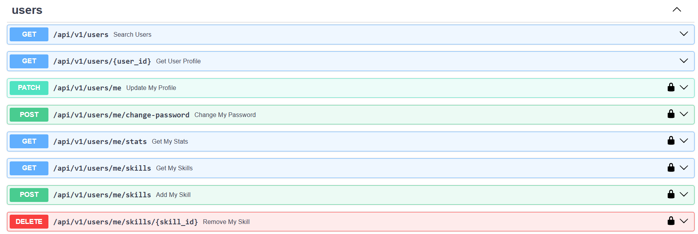
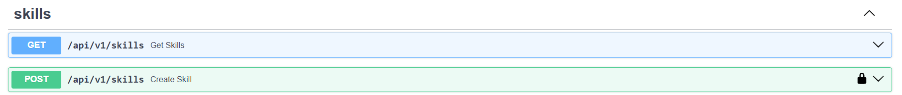
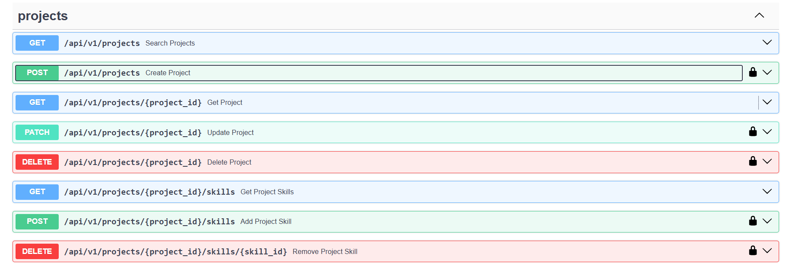
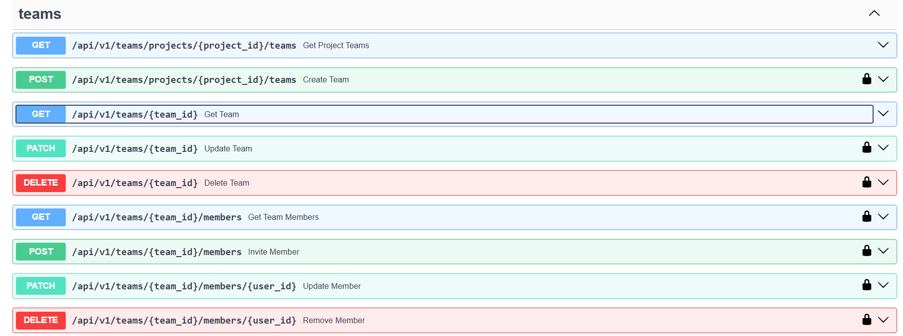
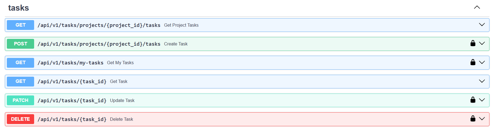

# Отчет по лабораторной работе №1

## Дисциплина: Веб-разработка
## Тема: Разработка платформы для поиска людей в команду (TeamFinder)

---

### 1. Выбор темы

Я выбрал тему **«Разработка платформы для поиска людей в команду»**.

**Краткое описание:**  
Платформа помогает пользователям находить партнеров для совместной работы над IT-проектами. Пользователи создают профили с указанием навыков, создают проекты, формируют команды, ставят задачи и отслеживают прогресс.

**Основной функционал:**
- Регистрация и JWT-аутентификация
- Управление профилем и навыками
- Создание и поиск проектов
- Формирование команд внутри проектов
- Управление задачами

---

### 2. Модель базы данных



*ER-диаграмма базы данных TeamFinder*

---

### 3. Архитектура и устройство приложения

Проект построен по **многослойной архитектуре** с четким разделением ответственности.

**Структура папок:**

app/<br>
├── api/ # Роутеры (слой HTTP)<br>
├── core/ # Конфиг, БД, безопасность, исключения<br>
├── models/ # SQLAlchemy ORM-модели<br>
├── schemas/ # Pydantic-схемы (валидация)<br>
├── services/ # Бизнес-логика<br>
└── scripts/ # Вспомогательные скрипты<br>

**Как это работает:**

1. **Запрос** → `api/` (роутер) → валидация через `schemas/`
2. Роутер вызывает метод из `services/`, передавая сессию БД
3. Сервис выполняет бизнес-логику, используя SQLAlchemy `models/`
4. Сервис возвращает ORM-объект, Pydantic преобразует его в JSON
5. FastAPI отправляет ответ клиенту

**Подключение к БД:**

```python
# app/core/database.py
from sqlalchemy.ext.asyncio import create_async_engine, async_sessionmaker

engine = create_async_engine(settings.DATABASE_URL, echo=settings.DEBUG)
AsyncSessionLocal = async_sessionmaker(engine, class_=AsyncSession, expire_on_commit=False)

async def get_db() -> AsyncSession:
    async with AsyncSessionLocal() as session:
        yield session
```

**Миграции**
Используется alembic

**Эндпоинты**

1. Auth


2. Users 


3. Skills (справочник навыков)


4. Projects (проекты)


5. Teams (команды)


6.  Tasks (задачи)


7. Admin (статистика)



**Аутентификация и безопасность:**

- Пароли хэшируются

- JWT-токены: access (30 мин) и refresh (7 дней)

- Refresh-токены хранятся в БД с ротацией (старый ревокалится)

- Зависимость get_current_user проверяет токен перед защищенными эндпоинтами


| Компонент | Ссылка |
|-----------|--------|
| Репозиторий проекта | [teamfinder-api](https://github.com/your-username/teamfinder-api) |
| `Практика 1` | [pr1](https://github.com/your-username/teamfinder-api/tree/main/app) |
| `Практика 2` | [pr2](https://github.com/your-username/teamfinder-api/tree/main/app/api) |
| `Практика 3` | [pr3](https://github.com/your-username/teamfinder-api/tree/main/app/models) |

