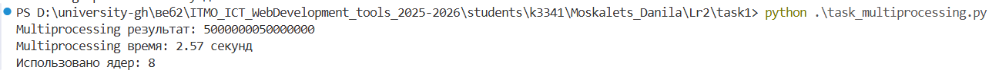

# Лабораторная работа №2

**Студент:** Москалец Данила Алексеевич  
**Университет:** ИТМО  
**Группа:** К3341  

---

## Задание

Понять отличия между потоками (threading), процессами (multiprocessing) и асинхронностью (async) в Python на практике. Исследовать эффективность каждого подхода для двух типов задач:

- CPU-bound (вычислительные задачи) — суммирование большого диапазона чисел
- I/O-bound (задачи ввода-вывода) — парсинг веб-страниц с сохранением в базу данных
---

## Задание 1: Сравнение подходов для CPU-bound задачи

### 2.1 Описание задачи
Написать три программы, вычисляющие сумму всех чисел от 1 до 10 000 000 (10 миллионов), используя:

1. Threading (многопоточность)
2. Multiprocessing (многопроцессорность)
3. Async (асинхронность)

Для ускорения вычислений задача разбивается на 4 параллельные подзадачи.

###  2.2 Особенности каждого подхода
| Подход         | Механизм                     | Особенности                                                                                                 |
|----------------|------------------------------|-------------------------------------------------------------------------------------------------------------|
| Threading      | Потоки в рамках одного процесса | Из-за GIL не дает реального параллелизма для CPU-задач. Подходит для I/O-bound задач.                      |
| Multiprocessing| Отдельные процессы           | Каждый процесс имеет свой GIL и выполняется на отдельном ядре. Идеален для CPU-bound задач.                |
| Async          | Event loop + корутины        | Предназначен для I/O-bound задач. Для CPU-задач требует использования многопроцессности или потоков.       |

### 2.3 Результаты выполнения 

### 2.4 Итоги 
1. Multiprocessing оказался самым быстрым (2.57 сек), так как каждый процесс имеет свой GIL и выполняется на отдельном ядре процессора, обеспечивая реальный параллелизм.

2. Threading показал худший результат (7.61 сек) из-за GIL одновременно выполняется только один поток, а переключение между ними создает дополнительные накладные расходы.

3. Async занял 5.31 сек, но по сути под капотом использовал multiprocessing, а дополнительные 2.74 секунды ушли на асинхронную обертку.

Итог: для вычислительных задач оптимален только multiprocessing - threading бесполезен, async неэффективен.

## Задание 2: Сравнение подходов для I/O-bound задачи

### 3.1 Описание задачи

Написать три программы для параллельного парсинга веб-страниц с сохранением данных в базу данных:

| URL | Тип данных | Что парсим |
|-----|------------|------------|
| https://news.ycombinator.com/ | Hacker News | Заголовки новостей, домены |

Данные сохраняются в PostgreSQL:
- `parsed_content` - заголовки и краткое содержание
- `skills` - извлеченные теги/хабы/языки как потенциальные навыки

### 3.2 Особенности реализации

| Подход | Библиотеки | Механизм |
|--------|------------|----------|
| Threading | requests, threading | Синхронные запросы в отдельных потоках |
| Multiprocessing | requests, multiprocessing | Синхронные запросы в отдельных процессах |
| Async | aiohttp, asyncio, asyncpg | Асинхронные запросы, неблокирующая работа с БД |

### 3.3 Результаты выполнения

- 
- 
- 

### 3.4 Выводы (Задание 2)

#### Анализ полученных результатов

В ходе выполнения второго задания были получены следующие результаты:

| Подход | Время выполнения | Количество спарсенных записей |
|--------|------------------|-------------------------------|
| Threading | 2.82 сек | ~15 |
| Multiprocessing | 3.20 сек | ~15 |
| Async | 1.21 сек | ~15 |

Async показал лучший результат (1.21 сек), так как идеально подходит для I/O-операций. Event loop позволяет одновременно ожидать ответы от нескольких серверов, не блокируя выполнение кода.

Threading занял второе место (2.82 сек). Потоки хорошо справляются с I/O, но создают накладные расходы на переключение контекста и потребляют больше памяти.

Multiprocessing оказался самым медленным (3.20 сек). Процессы неэффективны для I/O: каждый процесс требует отдельное соединение с БД, большие затраты памяти и времени на создание.

**Итог:** для I/O-задач оптимален async - он минимально нагружает систему и максимально утилизирует время ожидания.

---

## Общий вывод по лабораторной работе

Выбор подхода зависит от типа задачи:

- Для вычислительных задач (CPU-bound) эффективен только **multiprocessing** - он обходит GIL и использует все ядра процессора.
- Для задач ввода-вывода (I/O-bound) лидирует **async** - неблокирующие операции и event loop дают максимальную производительность.
- **Threading** занимает промежуточное положение: он бесполезен для вычислений из-за GIL, но может применяться для I/O, когда async сложен в реализации.
