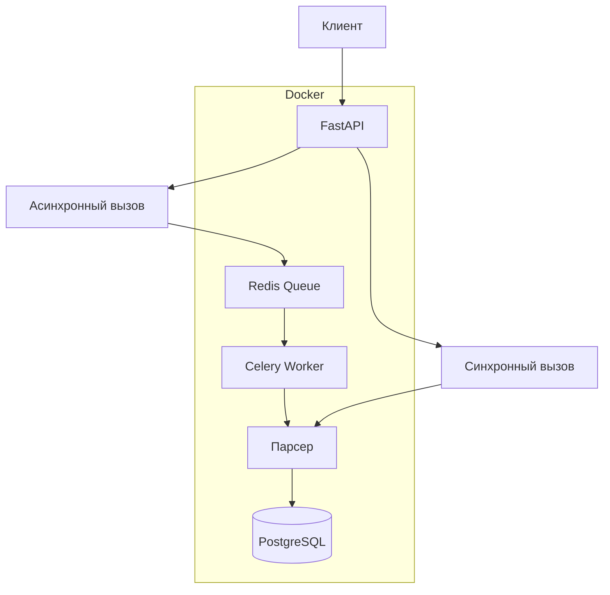
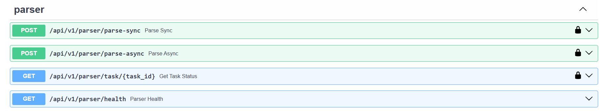

# Отчет по лабораторной работе №3

## Тема: Упаковка FastAPI приложения в Docker, работа с источниками данных и очереди

---

### 1. Цель работы

Научиться упаковывать FastAPI приложение в Docker, интегрировать парсер данных с базой данных и вызывать парсер через API и очередь.

---

### 2. Реализованные задачи

#### 2.1 Упаковка в Docker (Задача 1)

Разработаны `Dockerfile` для FastAPI приложения и `docker-compose.yml` для оркестрации сервисов.

**Состав сервисов в docker-compose.yml:**

| Сервис | Назначение |
|--------|------------|
| `postgres` | База данных PostgreSQL |
| `redis` | Брокер сообщений для Celery |
| `api` | FastAPI приложение |
| `celery_worker` | Воркер для асинхронных задач |
| `celery_beat` | Планировщик периодических задач |

#### 2.2 Эндпоинт для вызова парсера (Задача 2)

Добавлен эндпоинт в FastAPI для синхронного вызова парсера:

- **POST** `/api/v1/parser/parse-sync`- синхронный парсинг (ожидает результат)

#### 2.3 Асинхронный вызов через очередь (Задача 3)

Реализована асинхронная обработка через Celery + Redis:

- **POST** `/api/v1/parser/parse-async` - постановка задачи в очередь
- **GET** `/api/v1/parser/task/{task_id}` - получение статуса и результата

**Схема работы:**

---

### 3. Архитектура решения

### 4. Реализация эндпоинтов
